# Sly Multi Trainer

[Video showcase](https://www.youtube.com/watch?v=nfF_uditjxA)  

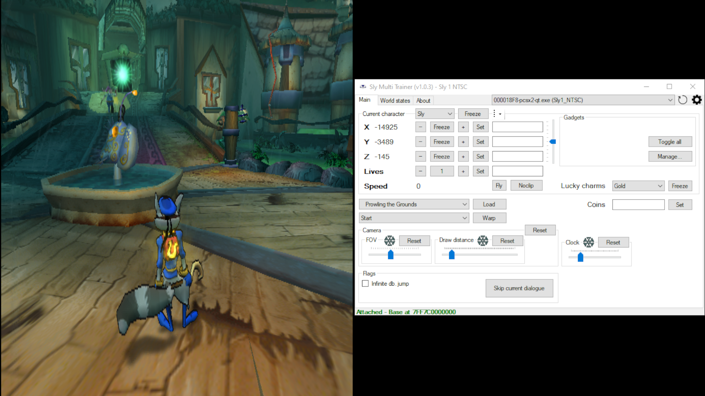
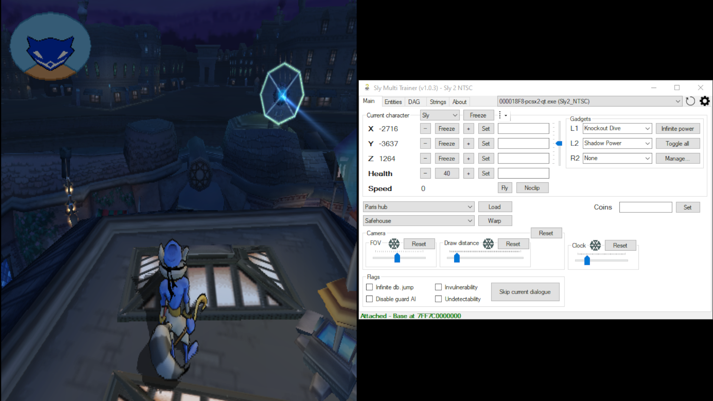
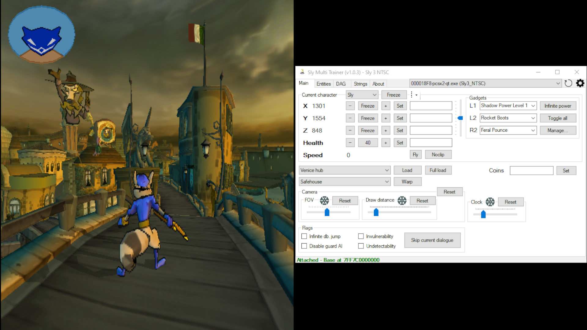

## Description
Sly Multi Trainer is a trainer for multiple Sly Cooper games. It supports the PCSX2 and RPCS3 emulators.  
Please, refer to the [Changelog](/SlyMultiTrainer-Changelog.txt) file for information about changes for each version.

Below there is a list of the supported builds.  
Do note that, even if a specific entry does not appear in the list, the trainer may still detect it as a valid build.  
This is because different discs can share the same executable, meaning there is no difference between them.  

|         Game          |                          Region                          | Short-format build date |   Serial   |   CRC    |
| :-------------------: | :------------------------------------------------------: | :---------------------: | :--------: | :------: |
|         Sly 1         |                           NTSC                           |        0824.2206        | SCUS-97198 | C77AF2CA |
|         Sly 1         |                           PAL                            |        1121.2105        | SCES-50917 | DA3DD765 |
|         Sly 1         |                          NTSC-J                          |        0131.1715        | SCPS-15036 | 15C88C7B |
|         Sly 1         |                          NTSC-K                          |        1231.1308        | SCKA-20004 | 71017DE1 |
|         Sly 1         |                        NTSC Demo                         |        0408.2044        | SCUS-97210 | EF7F0CE6 |
|         Sly 1         |                         PAL Demo                         |        1206.1234        | SCED-51452 | F3FD8A14 |
|         Sly 1         |                       NTSC-J Demo                        |        1219.2129        | PAPX-90231 | 9C29F787 |
|         Sly 1         |                       NTSC-K Demo                        |        1219.2129        | SCKA-90004 | 9CB33FB5 |
|         Sly 1         |             NTSC Demo Kiosk 2-12 Spring 2004             |        0131.1819        | SCUS-97383 | 7656425F |
|         Sly 1         |                    NTSC Demo June 14                     |        0614.2001        |            |          |
|         Sly 1         |                   PAL Demo November 18                   |        1118.1459        |            |          |
|         Sly 1         |             PAL Demo PlayStation Experience              |        0415.1306        | SCED-51148 | 53EBA5EB |
|         Sly 1         |                       NTSC May 19                        |        0519.1812        | SCUS-97198 | 515E82DE |
|         Sly 1         |                       NTSC May 21                        |        0521.1452        | SCUS-97198 | E50A78F8 |
|         Sly 1         |                      NTSC August 23                      |        0823.0119        | SCUS-97198 | 5E78A4F2 |
|         Sly 1         |                      PAL November 8                      |        1108.1202        | SCES-50917 | B9AB722F |
|         Sly 2         |                           NTSC                           |        0813.0032        | SCUS-97316 | 07652DD9 |
|         Sly 2         |                       PAL (v1.00)                        |        0914.1846        | SCES-52529 | FDA1CBF6 |
|         Sly 2         |                       PAL (v2.01)                        |        1006.2123        | SCES-52529 | 15DD1F6F |
|         Sly 2         |                          NTSC-J                          |        0121.1144        | SCPS-15090 | 615EA2DB |
|         Sly 2         |                          NTSC-K                          |        1221.1745        | SCKA-20044 | 518DD841 |
|         Sly 2         |                       NTSC E3 Demo                       |        0411.1757        | SCUS-97415 | 5B93397F |
|         Sly 2         |     NTSC Official PlayStation Magazine Demo Disc 089     |        0920.1827        | SCUS-97342 | 7B564230 |
|         Sly 2         |                     PAL Demo July 27                     |        0727.2115        |            |          |
|         Sly 2         |       NTSC Demo (Ratchet & Clank: Up Your Arsenal)       |        0831.2225        | SCUS-97353 | 45FE0CC4 |
|         Sly 2         |               PAL Demo (Ratchet & Clank 3)               |        0831.2137        | SCES-52456 | 17125698 |
|         Sly 2         | NTSC Demo (Ratchet and Clank: Up Your Arsenal August 11) |        0718.2021        | SCUS-97353 | D8EB2C29 |
|         Sly 2         |                      NTSC March 17                       |        0317.1405        | SCUS-97198 | DD0B5E6C |
|         Sly 2         |                       NTSC July 11                       |        0711.1656        | SCUS-97316 | A480549C |
|         Sly 2         |                      NTSC August 9                       |        0809.1956        | SCUS-97316 | DB54798A |
|         Sly 2         |                       PAL August 2                       |        0802.1031        | SCES-52529 | 4BE9708A |
|         Sly 2         |                     PAL September 11                     |        0911.1830        | SCES-52529 | B89723F2 |
|         Sly 3         |                           NTSC                           |        0828.0212        | SCUS-97464 | 8BC95883 |
|         Sly 3         |                           PAL                            |        0921.1843        | SCES-53409 | 8164C614 |
|         Sly 3         |                          NTSC-K                          |        1112.1525        | SCKA-20063 | A8CC1583 |
|         Sly 3         |                    NTSC Demo April 18                    |        0418.1711        |            |          |
|         Sly 3         |                     NTSC Demo July 7                     |        0707.2044        |            |          |
|         Sly 3         |                         PAL Demo                         |        0906.1452        | SCED-53802 | BAE3B5E9 |
|         Sly 3         |                   PAL Demo September 2                   |        0902.1844        |            |          |
|         Sly 3         |                       NTSC July 16                       |        0716.1854        | SCUS-97464 | 0190CF8B |
|         Sly 3         |                      NTSC August 24                      |        0824.2234        | SCUS-97464 | 779B6999 |
|         Sly 3         |                       PAL August 2                       |        0802.0136        | SCES-52529 | 8C146034 |
|         Sly 3         |                     PAL September 2                      |        0902.1747        | SCES-53409 | 3670B6F9 |
|         Sly 1         |                      NTSC (PS3 PSN)                      |        0906.1415        | NPUA80663  |          |
|         Sly 1         |                      PAL (PS3 PSN)                       |        1103.1309        | NPEA00341  |          |
|         Sly 1         |                     NTSC-K (PS3 PSN)                     |        1129.1638        | NPHA80174  |          |
|         Sly 2         |                      NTSC (PS3 PSN)                      |        0524.2241        | NPUA80664  |          |
|         Sly 2         |                      PAL (PS3 PSN)                       |        0524.2241        | NPEA00342  |          |
|         Sly 2         |                     NTSC-K (PS3 PSN)                     |        0524.2241        | NPHA80175  |          |
|         Sly 3         |                      NTSC (PS3 PSN)                      |        1222.1218        | NPUA80665  |          |
|         Sly 3         |                      PAL (PS3 PSN)                       |        1222.1218        | NPEA00343  |          |
|         Sly 3         |                     NTSC-K (PS3 PSN)                     |        1222.1218        | NPHA80176  |          |
|  The Sly Collection   |                           NTSC                           |                         | BCUS98246  |          |
|    The Sly Trilogy    |                           PAL                            |                         | BCES00968  |          |
|    The Sly Trilogy    |                            UK                            |                         | BCES00982  |          |
| Sly Cooper Collection |                          NTSC-J                          |                         | BCJS30061  |          |
| Sly Cooper Collection |                          NTSC-K                          |                         | BCKS10147  |          |

`Sly 1 NTSC Demo June 14` will be detected for the following discs:

|                      Region                      |   Serial   |   CRC    |
| :----------------------------------------------: | :--------: | :------: |
|         Jampack Demo Disc - Winter 2002          | SCUS-97235 | 7656425F |
| Official U.S. PlayStation Magazine Demo Disc 062 | SCUS-97188 | 7656425F |
|               Kiosk Demo Disc 2.7                | SCUS-97227 | 7656425F |
|               Kiosk Demo Disc 2.9                | SCUS-97270 | 7656425F |

`Sly 1 PAL Demo November 18` will be detected for the following discs:

|                       Region                        |   Serial   |   CRC    |
| :-------------------------------------------------: | :--------: | :------: |
|       Official PlayStation 2 Magazine Demo 30       | SCED-51457 | 90C0E5F1 |
|  Official PlayStation 2 Magazine Demo 30 (Germany)  | SCED-51483 | 90C0E5F1 |
|  Official PlayStation 2 Magazine Demo 30 (France)   | SCED-51489 | 90C0E5F1 |
| Official PlayStation 2 Magazine Demo 30 (Australia) | SCED-51485 | 90C0E5F1 |
|   Official PlayStation 2 Magazine Demo 30 (Spain)   | SCED-51552 | 90C0E5F1 |
|       Official PlayStation 2 Magazine Demo 37       | SCED-51572 | 90C0E5F1 |
|       Official PlayStation 2 Magazine Demo 38       | SCED-51573 | 90C0E5F1 |
|       Official PlayStation 2 Magazine Demo 83       | SCED-54692 | EDCD7FA9 |
|             Tango - Game On Demo Disc 1             | SCED-51454 | 9FA95865 |
|                    Bonus Demo 4                     | SCED-51486 | B756418E |

`Sly 2 PAL Demo July 27` will be detected for the following discs:

|                        Region                        |   Serial   |   CRC    |
| :--------------------------------------------------: | :--------: | :------: |
|     Ratchet & Clank 3 + Sly 2 - Band of Thieves      | SCED-52848 | 4FB4FBA3 |
|       Official PlayStation 2 Magazine Demo 52        | SCED-52167 | EDCD7FA9 |
|       Official PlayStation 2 Magazine Demo 61        | SCED-53209 | 38174DD2 |
|       Official PlayStation 2 Magazine Demo 88        | SCED-54413 | EDCD7FA9 |
|  Official PlayStation 2 Magazine Spécial Noël 2004   | SCED-52996 | EDCD7FA9 |
| Official PlayStation 2 Magazine Sonderausgabe 2004/3 | SCED-52997 | EDCD7FA9 |
|    Magazine Ufficiale PlayStation 2 Italia 11/04     | SCED-52981 | EDCD7FA9 |
|                    SCEE Hits Demo                    | SCED-52970 | 3CFE530D |

`Sly 3 NTSC Demo April 18` will be detected for the following discs:

|                           Region                           |   Serial   |   CRC    |
| :--------------------------------------------------------: | :--------: | :------: |
|                        NTSC E3 Demo                        | SCUS-97484 | 3130A4D3 |
| PlayStation Underground Demo Disc - Holiday 2005 [T-Rated] | SCUS-97528 | 7B564230 |
|                    Jampack Winter 2005                     | SCUS-97484 | 3130A4D3 |
|      Official U.S. PlayStation Magazine Demo Disc 107      | SCUS-97535 | 7B564230 |

`Sly 3 NTSC Demo July 7` will be detected for the following discs:

|                   Region                   |   Serial   |   CRC    |
| :----------------------------------------: | :--------: | :------: |
|                Regular Demo                | SCUS-97527 | 35CCFA60 |
| Jampack Demo Disc Volume 13 (USA) (Mature) | SCUS-97492 | 7B564230 |
|         Kiosk Demo Disc Q2-Q3 2006         | SCUS-97557 | 7B564230 |
|         Kiosk Demo Disc Q3-Q4 2005         | SCUS-97424 | 7B564230 |

`Sly 3 PAL Demo September 2` will be detected for the following discs:

|                         Region                         |   Serial   |   CRC    |
| :----------------------------------------------------: | :--------: | :------: |
|        Official PlayStation 2 Magazine Demo 66         | SCED-53169 | EDCD7FA9 |
|        Official PlayStation 2 Magazine Demo 67         | SCED-53215 | 995D32A4 |
|        Official PlayStation 2 Magazine Demo 82         | SCED-54642 | EDCD7FA9 |
| Official PlayStation 2 Magazine Germany Special 3/2005 | SCED-53938 | EDCD7FA9 |
| Ufficiale PlayStation 2 Italia Kids Special 2005 Demo  | SCED-53798 | EDCD7FA9 |
|                     Bonus Demo 10                      | SCED-53515 | DF77611A |
|                  Bonus Demo 10 (You)                   | SCED-53513 | DF77611A |

## How to run / Troubleshooting

**IMPORTANT:** *.NET Desktop Runtime 10.0 x64* must be installed in order to run this program. 
https://dotnet.microsoft.com/en-us/download/dotnet/10.0

- Download latest at https://github.com/NiV-L-A/SlyMultiTrainer/releases/latest
- ***The application may need to be ran as administrator***
- The application automatically detects the PCSX2/RPCS3 process and the game build
- A drop-down list is available to target a specific valid process if more than one is detected
- Controls appear and disappear depending on the build that is being detected
  - For example, for all Sly 1 builds a `Lucky charms` drop-down list is present, but it is not present for all Sly 2 and Sly 3 builds
  - This also applies to builds of the same game: for example, a checkbox control is present for the build `Sly 2 NTSC` which toggles invulnerability but it is not present for `Sly 2 NTSC E3 Demo`  

## Features
- A button to re-initialize the application. This has the same effect as closing and opening the application
- A button (gear icon) to modify some of the application's settings and behavior:
  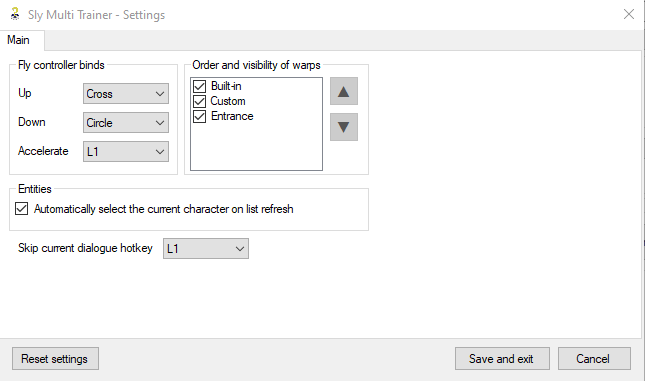
- Load maps
- Warp to locations in the current map:
  - `Built-in` warp points that come with the app
  - `Custom` warp points that the user can create, modify and delete
  - `Entrance` warp points with format `Entrance [Id] [Address]`
    - Read on the fly from the game's memory
    - The display text for each entrance location shows its id and memory address
    - NOTE: The app internally sorts the list by id
    - If `(Splice)` is at the end of the text, it indicates there's game code attached to the warp point that might modify the position or play a transition sequence
      - E.g. in Sly 2 NTSC Paris hub the `Entrance 189 [140E6E0] (Splice)` warp point, when triggered normally by the game, should place the characters inside the safehouse
- Edit coins
- Edit and freeze the camera's FOV
- Edit and freeze the camera's draw distance
- Edit and freeze the game's clock
- Edit and freeze health/lives
- Edit and freeze the current character's coordinates
- A tool strip menu with the following items:
  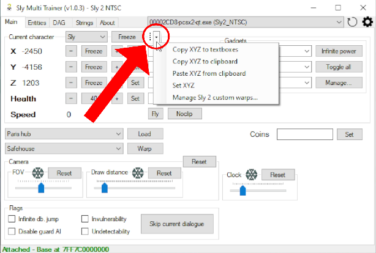
  - Copy XYZ to textboxes: copy the current character's XYZ coordinates to their respective textboxes
  - Copy XYZ to clipboard: copy the current character's XYZ coordinates to the clipboard
  - Paste XYZ from clipboard: paste to the current character's XYZ coordinates textboxes 3 values:
    - Can be in the format `X.n Y.n Z.n` or `X,n Y,n Z,n`, where `X`, `Y`, `Z` and `n` are numeric values
    - Useful when the 3 values are copied from Cheat Engine's memory viewer (with display type set to "Float")
  - Set XYZ: equivalent to clicking on the "Set" button for each axis, all at once
  - Manage custom warps...: open a form to manage the current game's custom warps
    - Stored in the current user's Documents folder (e.g. `C:\Users\Admin\Documents\SlyMultiTrainer\SlyMultiTrainer_CustomWarps.json`)
    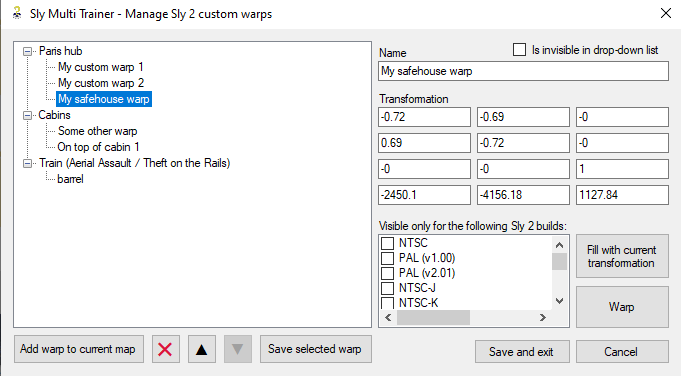
- Change the current character through the "Current character" drop-down list
  - To actually change the character, the map needs to be reloaded
  - For Sly 3, the drop-down list only shows the characters that are available in the current map (e.g. only Sly is available in the Police Station of Episode 1)
- Fly
  - Hold cross to go up, hold circle to go down and hold L1 to accelerate
- A trackbar is present to edit the amount to add to the coordinates when pressing the "-" and "+" buttons. The trackbar is also used for the speed when the fly mode is enabled
- Noclip
- Toggle all gadgets
- Toggle specific gadgets
- Infinite gadget power
- Modify gadget binds
- Disable guards AI
- Invulnerability
- Undetectability
- Infinite double jump
- Skip current dialogue
- Sly 1: World states tab
  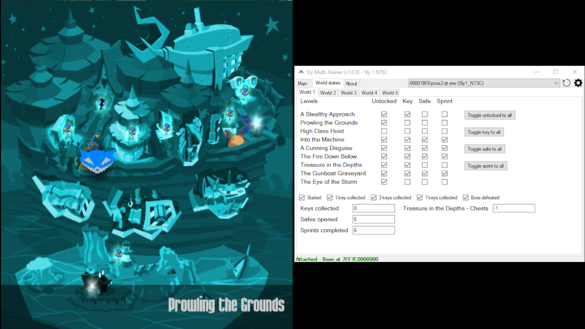
  - 5 sub-tabs for each world
  - Edit each world's "Started", "1 key collected", "3 keys collected", "7 keys collected" and "Boss defeated" flags
  - Edit each world's "Keys collected", "Safes opened" and "Sprints completed" values
  - Edit each level's "Unlocked", "Key", "Safe" and "Sprint" flags
  - World 1
    - Edit "Treasure in the Depths - Chests"
  - World 2
    - Edit "At the Dog Track - Nitros"
    - Edit "At the Dog Track - Laps"
  - World 3
    - Edit "Piranha Lake - Fish"
    - Edit "Piranha Lake - Torch"
    - Edit "Down Home Cooking - Chicken"
  - World 4
    - Edit "A Desperate Race - Nitros"
    - Edit "A Desperate Race - Laps"
  - World 5
    - Edit "Burning Rubber - Fire slugs computer"
    - Edit "Burning Rubber - Computer"
    - Edit "Bentley Comes Through - Chip"
- Sly 2 & 3: Entities tab
  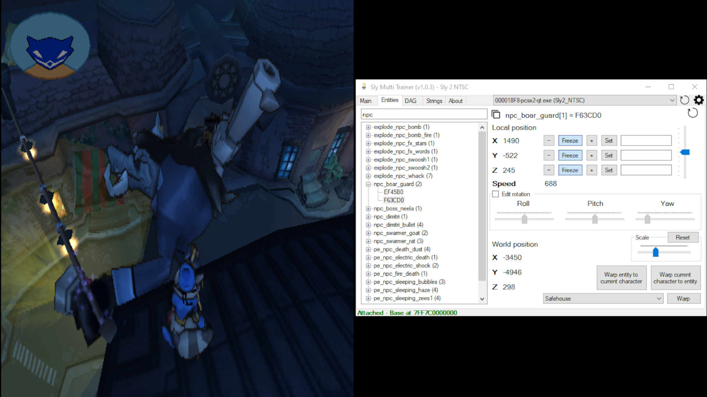
  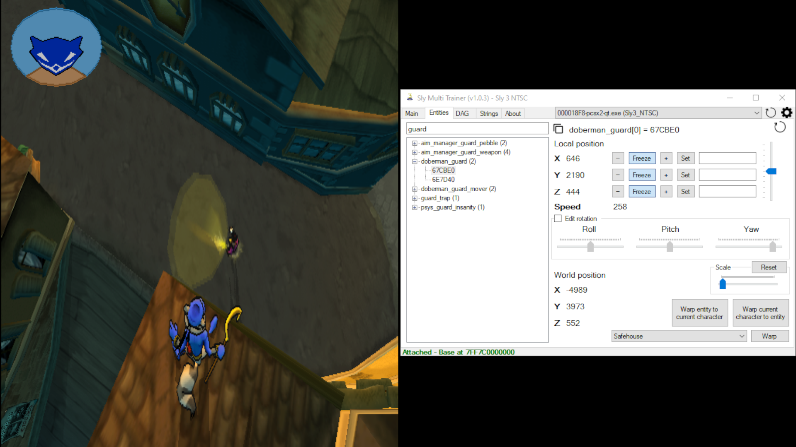
  - Populated on map change
  - "Refresh" button to force reading the game's memory again to parse the entities list
  - Automatically select the node of the current character on refresh
  - Automatically focus on the search bar on refresh
  - Search bar to filter through the list
    - The search function filters through the entities' names and entities' addresses
  - When a node is selected:
    - The address of the selected entity is shown and is able to be copied to the clipboard
    - Depending on the entity's properties, it might be possible to edit its local transformation (position, rotation and scale)
    - Show world (final) position
    - Warp the current character to the selected entity
    - Warp the selected entity to the current character
    - Warp the selected entity to one of the available warp points
- Sly 2 & 3: DAG tab
  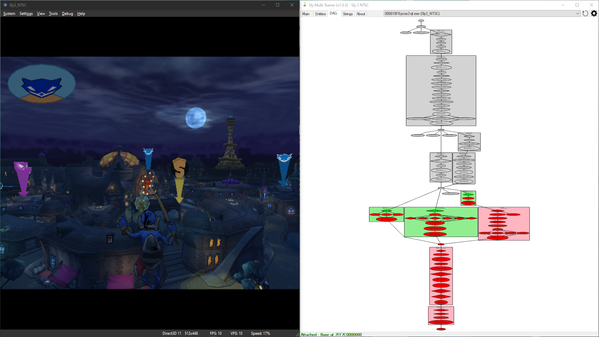
  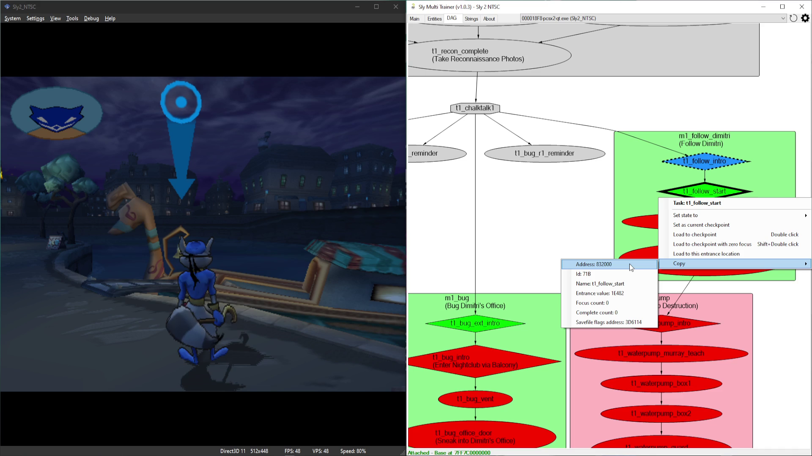
  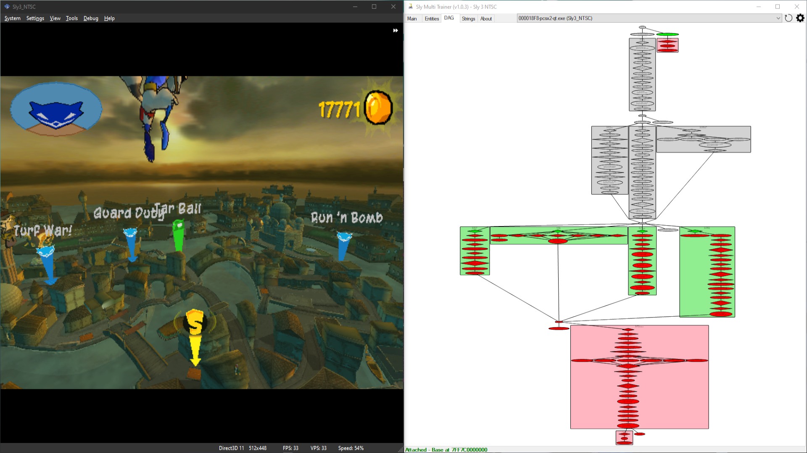
  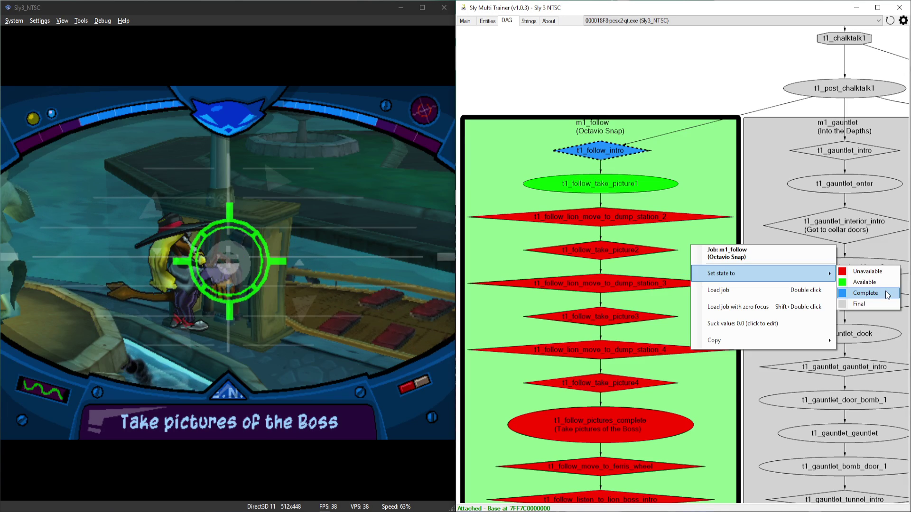
  - Populated on map change
  - Might take some moments to show
  - Mouse wheel to zoom-in and zoom-out
  - Hold left click and drag to pan
  - Right click on the graph to open its context menu
    - Shows the number of tasks parsed
    - Go to root: goes to the root node of the DAG
    - Restore pan and zoom: restores the user's transformation to fit the current DAG's size
    - Settings (requires refresh)
      - Lock pan and zoom on refresh: if checked, do not assume the default graph's transformation on refresh
      - Show name: show the node's name
      - Show address: show the node's address
      - Show id: show the node's id
      - Show id as decimal: show the node's id as decimal instead of hexadecimal
    - Refresh: force reading the game's memory again to parse the DAG (assigned hotkey: F5)
    - Search node...: Search a node (task or job) in the graph by typing its address or its id. The app will zoom in on the node if a match is found (assigned hotkey: F3)
      - The input textbox is filled with the current clipboard's content, but only if its length is less than 9 characters
      - If "Address" is chosen from the drop-down list, the input value will be parsed as hexadecimal
      - If "Id" is chosen from the drop-down list, the input value will be parsed:
        - As decimal if the option "Show id as decimal" in the graph's settings is checked
        - As hexadecimal if the option "Show id as decimal" in the graph's settings is not checked
    - Save as png...: save the graph as a png file
  - Right click on a task to open its context menu
    - Set state to
      - Unavailable, Available, Complete or Final
    - Copy (to clipboard)
      - Address
      - Id
      - Name
      - Focus count
      - Complete count
      - Savefile flags address
        - For Sly 2 NTSC March 17 and Sly 2 NTSC E3 Demo:
          - Array of 3 integers, in which
            - The first indicates if the task has been in a "complete" state (internally called "is_complete")
            - The second is "Focus count" (copied to the task's struct on map loading)
            - The third is the state (copied to the task's struct on map loading)
        - For all other builds:
          - Array of 5 integers, in which:
            - The first is "Focus count" (copied to the task's struct on map loading)
            - The second is "Complete count" (copied to the task's struct on map loading)
            - The third indicates if the task has been in a "complete" state (internally called "is_complete")
            - The fourth is the state (copied to the task's struct on map loading)
            - The fifth is internally called "from_memcard"
      - Goal description (only if the node has a goal description)
      - Entrance value (only if the node is a checkpoint)
    - If the node is a checkpoint there are more options:
      - Set as current checkpoint or Unset as current checkpoint
      - Load to checkpoint (Assigned hotkey: double click)
      - Load to checkpoint with zero focus (Assigned hotkey: Shift+double click)
      - Load to this entrance location
  - Right click on a job to open its context menu
    - Set state to
      - Unavailable, Available, Complete or Final
    - Load job (Assigned hotkey: double click)
    - Load job with zero focus (Assigned hotkey: Shift+double click)
    - Suck value (click to edit)
    - Copy
      - Address
      - Id
      - Name
      - Description
      - Savefile flags address
        - For Sly 2 NTSC March 17 and Sly 2 NTSC E3 Demo:
          - Array of 2 integers, in which
            - The first is the number of attempts (internally called "focus_count")
            - The second indicates if the job has been completed (internally called "is_complete")
        - For all the other builds:
          - Array of 2 integers and 2 floats, in which:
            - The first is the number of attempts (internally called "focus_count")
            - The second indicates if the job has been completed (internally called "is_complete")
            - The third is the playtime (internally called "time_played")
            - The fourth is the suck value (internally called "suck_value")
- Sly 2 & 3: Strings tab
  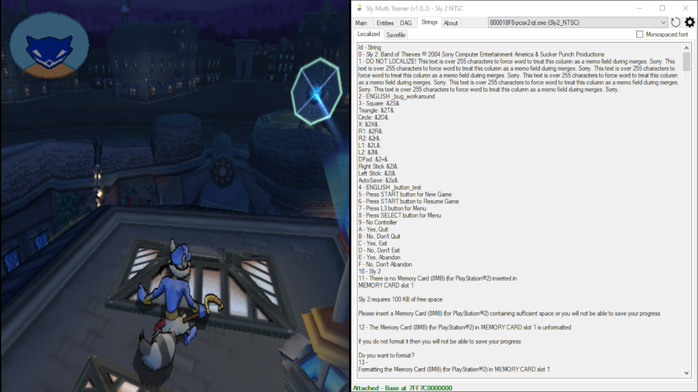
  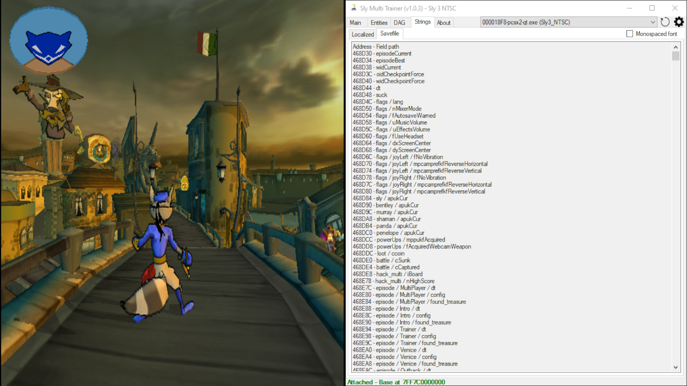
  - A tab that contains 2 sub-tabs:
    - "Localized" tab:
      - Populated on map change
      - These strings are localized on non-english versions of the games
      - Each entry represents the string id and the string itself, separated by a "-" symbol
      - NOTE: The app internally sorts the list by string id
    - "Savefile" tab:
      - Each entry represents a field in the savefile
      - NOTE: The app internally sorts the list by address
    - For both tabs there is a checkbox to change the font of the textboxes to a monospaced one 
- "About" tab
  - Credits
  - Addresses list used for the current build, sorted in alphabetical order

## TO-DO
- General
  - Dark mode
  - Hide HUD
- Sly 1
  - Disable guards AI
  - Invulnerability
  - Undetectability
  - Clue bottles
- Sly 1 NTSC Demo
  - FOV
  - Noclip
- Sly 1 NTSC Demo June 14
  - Noclip
- Sly 1 PAL Demo PlayStation Experience
  - FOV
  - Noclip
- Sly 1 NTSC May 19
  - FOV
  - Noclip
- Sly 1 NTSC May 21
  - FOV
  - Noclip
- Sly 2
  - Clue bottles
- Sly 2 NTSC E3 Demo
  - Invulnerability
- Sly 2 NTSC Official PlayStation Magazine Demo Disc 089
  - Invulnerability
- Sly 2 PAL Demo July 27
  - Invulnerability
- Sly 2 NTSC Demo (Ratchet & Clank: Up Your Arsenal)
  - Invulnerability
- Sly 2 PAL Demo (Ratchet & Clank 3)
  - Invulnerability
- Sly 2 NTSC Demo (Ratchet and Clank: Up Your Arsenal August 11)
  - Invulnerability
- Sly 2 NTSC March 17
  - Invulnerability
- Sly 2 NTSC July 11
  - Invulnerability
- Sly 3
  - Other characters (e.g. Carmelita) in the characters drop-down list
  - Carmelita's accelerate when fly mode is enabled
- Entities
  - Rotation doesn't always work
- DAG
  - Some notification (like a progress bar) when loading
  - Some edges should be straight but aren't (sly 2 ntsc ep1, satellite sabotage into breaking and entering)
  - Cluster's label should be center aligned
  - Graph->Settings without refreshing (this works for nodes, but msagl doesn't have a way to resize the cluster to the new node sizes, which would also mean extend or shrink the edges)
  - Let the user change values of a node (map id, entity id, etc...)
  - "Continue lineup" function from the debug menu
  - "Force episode complete" function from the debug menu

## Known issues
- Sly 1
  - Warping sometimes doesn't work properly.
- Sly 3
  - Warping sometimes doesn't work properly.
- Sly 3 NTSC Demo April 18
  - Sly's gadgets "Venice Disguise" and "Pope Disguise" will crash upon equipping them. If the gadgets are selected and the map is reloaded, a crash will not happen.
- Sly 3 NTSC Demo July 7
  - Gadget binds for L2 and R2 don't work
- DAG
  - Sly 2
    - Loading the task in Episode 1 "t1_bug_intro" without focus will try to play the binocucom dialogue immediately (and also, failing to do so)
    - Loading the task in Episode 2 "t2_steal_tuxedo_intro" will not play the binocucom dialogue after walking inside the hotel
    - Loading the task in Episode 7 "t7_laser_outside" without focus will not play the binocucom dialogue, which will cause the first crystal to not be interactable
    - Loading the task in Episode 7 "t7_bearcave_intro_int" without focus will not play the binocucom dialogue, which will cause the radio transmitters to not be pickable
    - Loading the task in Episode 7 "t7_bearcave_back_outside" without focus will play the binocucom dialogue while sly is still crawling outside the bearcave
  - Sly 3
    - Loading the task in Episode 4 "t4_van_defend_pkturret_intro" with the Grapple-Cam gadget already acquired will make the gang's van not appear
    - NTSC Demo July 7:
      - Loading some checkpoints forces the game to load with 3D screen enabled
    - NTSC July 16:
      - Loading some checkpoints forces the game to load with 3D screen enabled
    - PAL August 2:
      - Loading some checkpoints forces the game to load with 3D screen enabled

## Build instructions
Sly Multi Trainer uses a [modified version of memory.dll](https://github.com/NiV-L-A/memory.dll) to facilitate the development of the program. 
The modifications add additional data types for read and write operations and a custom way to deal with addresses, offsets and pointers.

1. Clone the SlyMultiTrainer repository by clicking on the "Code" button and selecting "Open with Visual Studio"
2. Download the memory.dll source code from [this fork of memory.dll](https://github.com/NiV-L-A/memory.dll) by clicking on the "Code" button and selecting "Download ZIP"
3. Extract the memory.dll-master.zip archive
4. In Visual Studio, in the Solution Explorer window, right click on the SlyMultiTrainer solution, select "Add" and then "Existing project..."
5. Select the "Memory.csproj" file from the extracted memory.dll-master.zip archive
6. In the Solution Explorer window, expand the SlyMultiTrainer project entry, right click on "Dependencies" and select "Add Project Reference..."
7. On the left side select "Projects", add the "Memory" item and make sure its checkbox is checked. Click OK
8. Visual Studio should recognize the file and the project should accept the "Memory" namespace
9. Run the application by clicking on "Debug" and then "Start Debugging"
  - Do note that debug symbols are not emitted when in "Release" mode. To actually debug the application (e.g. set breakpoints) make sure to be in "Debug" mode

## Release workflow
1. In the Solution Explorer window, right click on the SlyMultiTrainer project entry, go to "Properties", "Package" and increase the "Package Version"
2. Run the application and make sure the window's title reflects the new package version
3. Remove unused using directives
4. Change changelog
5. In the Solution Explorer window, right click on the SlyMultiTrainer project entry and select "Publish". Use the following settings and then click "Publish":
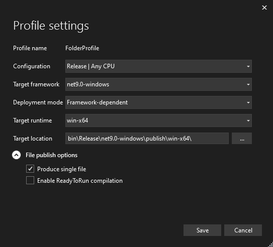

## Credits
- NiV-L-A
- TheOnlyZac
- fr4nk0
- SlyCooperReloadCoded
- Sly Cooper Modding Discord Server: https://discord.gg/2GSXcEzPJA
- memory.dll: https://github.com/NiV-L-A/memory.dll
- Microsoft Automatic Graph Layout: https://github.com/microsoft/automatic-graph-layout